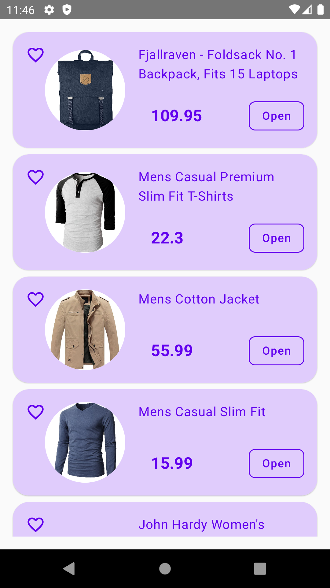
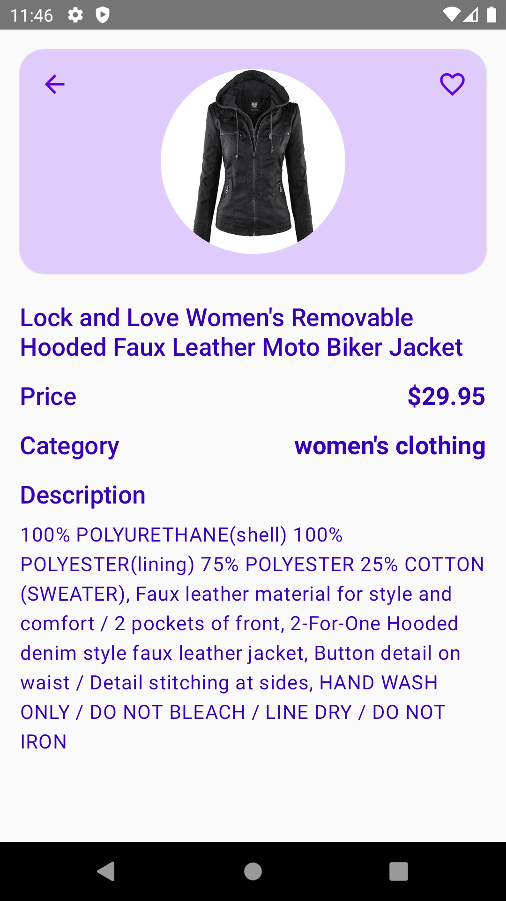

# Showcase App (Kotlin Multiplatform)

This is a showcase mobile application built with **Kotlin Multiplatform** and following **Domain-Driven Design (DDD)** principles. The app presents a feed of products and offers detailed views for each item, using data retrieved from the [Fake Store API](https://fakestoreapi.com/). This project demonstrates a cross-platform approach, running seamlessly on both Android and iOS with shared business logic, allowing for consistent functionality across devices.

## Screenshots

| Main Feed                                           | Product Details                                           |
|-----------------------------------------------------|-----------------------------------------------------------|
|  |  |

## Features

- **Cross-Platform Support**: Runs on both **Android** and **iOS** platforms with shared core logic.
- **Product Feed**: Displays a list of products on the main feed.
- **Details Screen**: Provides a detailed view for each product when selected.
- **DDD Architecture**: Organizes the app into layers and modules based on **Domain-Driven Design** principles, creating a maintainable and scalable architecture.

## Architecture & Technical Details

The app follows a **Model-View-Intent (MVI)** architecture and is structured with **Domain-Driven Design (DDD)**, separating the domain logic, application logic, and infrastructure. This structure ensures that each layer is responsible for its distinct set of functions, making the app modular and easier to maintain.

- **MVI Architecture**: The MVI architecture is implemented using **MVIKotlin**, which supports unidirectional data flow and state management, making the app more predictable and testable.
- **Dependency Injection**: Managed using **Koin**, allowing flexible injection of dependencies across modules.
- **Networking**: API interactions are handled by **Ktor**, which provides multiplatform HTTP client support for Android and iOS.
- **Navigation**: Navigation between screens is handled by **Decompose**, a multiplatform library that works well with Jetpack Compose and SwiftUI.
- **Image Loading**: Utilizes **Landscapist-Coil** for efficient image loading and caching on Android.
- **Concurrency**: **Kotlin Coroutines** are used for managing asynchronous tasks, ensuring smooth user interactions and background processing.

## Libraries Used

Here’s a summary of the main libraries included in this project, along with their primary purpose:

### Testing
- **kotlin-test** and **kotlin-test-junit**: Core Kotlin testing libraries.
- **junit**: Provides basic unit testing for non-UI logic.
- **mockk** and **mockk-android**: Used for mocking objects in tests, making it easier to isolate components for unit testing.

### AndroidX Libraries
- **androidx-core-ktx**, **androidx-appcompat**, **androidx-material**: Core Android libraries providing extended Kotlin support, compatibility features, and Material Design components.
- **androidx-constraintlayout**: For creating complex UI layouts in the app.

### Lifecycle and UI Libraries
- **androidx-lifecycle-viewmodel**: Lifecycle-aware ViewModel components.
- **androidx-activity-compose** and **androidx-lifecycle-runtime-compose**: Libraries to integrate Jetpack Compose with activity and lifecycle management.

### Concurrency
- **kotlinx-coroutines-core**, **kotlinx-coroutines-android**, **kotlinx-coroutines-test**: Libraries for coroutines to manage threading and asynchronous programming.

### Networking and Serialization
- **ktor-client-core**, **ktor-client-okhttp**, **ktor-client-darwin**: Provide a multiplatform HTTP client, enabling API calls across both platforms.
- **ktor-client-content-negotiation** and **ktor-client-logging**: Used for JSON serialization and logging of network requests, respectively.
- **ktor-serialization-kotlinx-json**: Supports JSON parsing.

### Dependency Injection
- **koin-core**, **koin-android**, **koin-compose**: Dependency injection framework tailored for multiplatform support, making it easy to inject dependencies across shared and platform-specific code.

### Architecture and Navigation
- **mvikotlin** and **decompose**: MVIKotlin facilitates MVI architecture, while Decompose handles multiplatform navigation.
- **landscapist-coil**: Efficiently loads and caches images, using Coil for image loading on Android.

## Additional Notes

This project aims to showcase the use of **Kotlin Multiplatform** and **DDD** in building maintainable applications that run on both Android and iOS. By utilizing shared code and key libraries, the app provides a seamless experience across both platforms while maintaining clean and modular code. This approach demonstrates the power of a well-structured architecture for mobile applications.
